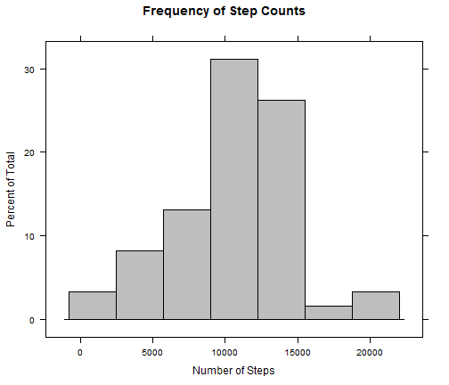
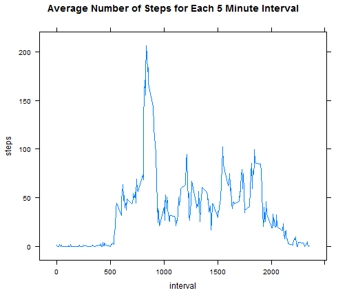
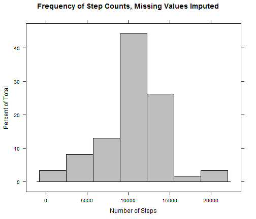
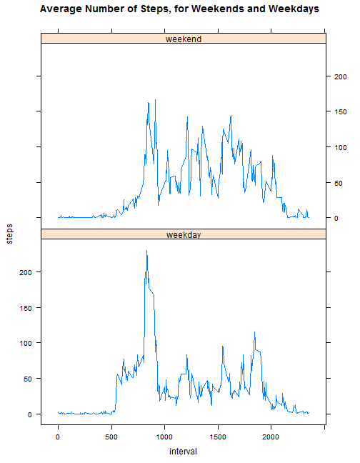

# Reproducible Research: Peer Assessment 1  
# Investigation of Personal Movement Data
  
In this investigation, we are looking at personal movement data collected from a single individual
collected over a period of two months, October and November 2012.  

Counts of steps taken were recorded at five minute intervals throughout this 61 day timeframe using
a personal activity monitoring device.

## Loading and preprocessing the data
  
We begin by doing some setup, and loading the activity data into a dataframe. This dataframe is 
transformed using the aggregate function into two new dataframes, act1 and act2. act1 contains 61 
rows, each row representing the sum of all steps taken during each day. act2 contains 288 rows, 
with each row representing the mean value of steps for each of the 288 daily intervals across all
days in the sample. We will use these "flattened" datasets for all further analyses.
  

```r
if (!file.exists("C:/coursera")) {
  dir.create("C:/coursera")
}
setwd("C:/coursera")
library(lattice)
```

```
## Warning: package 'lattice' was built under R version 3.1.1
```

```r
if(!file.exists("activity.zip")) {
  link <- "https://d396qusza40orc.cloudfront.net/repdata_data_activity.zip"
  download.file(link, destfile="activity.zip", method="curl")
}
activity <- read.csv(unzip("activity.zip"))

datelist <- activity$date
intlist <- activity$interval
act1 <-aggregate(activity$steps, by=list(datelist), FUN=sum, na.rm=FALSE)
act2 <-aggregate(activity$steps, by=list(intlist), FUN=mean, na.rm=TRUE)
names(act1) <- c("date", "steps")
names(act2) <- c("interval", "steps")
```
 
We can take a look at the newly created act1 and act2 datasets, just to be sure we have a good sense
of what they are doing:
  
act1:


```r
head(act1)
```

```
##         date steps
## 1 2012-10-01    NA
## 2 2012-10-02   126
## 3 2012-10-03 11352
## 4 2012-10-04 12116
## 5 2012-10-05 13294
## 6 2012-10-06 15420
```

And act2:


```r
head(act2)
```

```
##   interval   steps
## 1        0 1.71698
## 2        5 0.33962
## 3       10 0.13208
## 4       15 0.15094
## 5       20 0.07547
## 6       25 2.09434
```
  
## What is mean total number of steps taken per day?
  
The histogram below shows the distribution pattern of the total daily step counts. The data seem to 
follow a fairly smooth bell-curve distribution pattern, with the greatest number of days displaying
step counts just over 10000. Below the histogram, the mean (10766.19) and median (10765) values for these same data are printed, and closely conform to the pattern shown in the histogram.
  

```r
histogram(act1$steps, main="Frequency of Step Counts", xlab="Number of Steps", col="gray")
```

 

```r
daymean <- mean(act1$steps, na.rm=TRUE)
daymed <- median(act1$steps, na.rm=TRUE)
cat("Mean steps per day = ", daymean)
```

```
## Mean steps per day =  10766
```

```r
cat("Median steps per day = ", daymed)
```

```
## Median steps per day =  10765
```


## What is the average daily activity pattern?
  
To visualize the pattern of movement throughout the day, we create a line plot of the data in act2, which
contains the mean number of steps taken during each of the 288 intervals during the study timeframe. The
individual shows a pattern of very low activity early in the series, corresponding with sleep, followed
by the peak period of activity in the morning. Later in the day, there are three smaller peaks in 
activity. The maximum average steps per interval occurs at interval 835, which we can verify visually
on the plot.
  

```r
xyplot(steps ~ interval, data=act2, type="l", main="Average Number of Steps for Each 5 Minute Interval")
```

 

```r
maxrow <- act2[(act2$steps == max(act2$steps)),]
intmax <- maxrow$interval
cat("Maximum number of steps taken per day = ", intmax)
```

```
## Maximum number of steps taken per day =  835
```

## Imputing missing values
  
Because there were a significant number of NA values in the dataset -- 2304 in total, we test to see how
imputing these missing values affects the data. To do this, we substitute the average value for the
steps measurement from each interval into any corresponding interval for which there is a NA value. 
Then we construct a new dataset, actnona, in which the missing values have been filled in. By looking 
at the beginning of this dataframe, we can see that the steps values for the first date in the set, 
which had previously been NA, have been filled in with these averaged values.
  

```r
allnas <- sum(is.na(activity$steps))

addcol <- rep(act2$steps, times=length(levels(datelist)))
actnona <- cbind(activity, addcol)

actnona <- within(actnona, steps <- ifelse(!is.na(steps), steps, addcol))
actnona <- actnona[,1:3]

head(actnona)
```

```
##     steps       date interval
## 1 1.71698 2012-10-01        0
## 2 0.33962 2012-10-01        5
## 3 0.13208 2012-10-01       10
## 4 0.15094 2012-10-01       15
## 5 0.07547 2012-10-01       20
## 6 2.09434 2012-10-01       25
```
  
Now we can create a new "flattened" dataset using the aggregate function, just as we did before when
we created act1 with each row representing the sum of all steps taken during each day. Visualizing the
data as before, using a histogram of daily step frequencies, it seems that imputing the missing values
has not had much, if any, effect on the types of analytical results that can be obtained from the data.
  
We can confirm that this is true by again computing the mean and median values for the daily step data.
Comparing it with the earlier data, we see that the values for the mean are unchanged, while the value
for the median now inherits the value of the mean, since there were a few days with no data, for which the mean value has now been assigned. It turns out that one of these days now represents the median.  
  

```r
act1nona <-aggregate(actnona$steps, by=list(datelist), FUN=sum)
names(act1nona) <- c("date", "steps")
histogram(act1nona$steps, main="Frequency of Step Counts, Missing Values Imputed",
          xlab="Number of Steps", col="gray")
```

 

```r
daymeannona <- mean(act1nona$steps)
daymednona <- median(act1nona$steps)
cat("The mean value of steps per day, with NA values imputed is ",daymeannona,
    ", the same value as the previously reported mean, ",daymean,".")
```

```
## The mean value of steps per day, with NA values imputed is  10766 , the same value as the previously reported mean,  10766 .
```

```r
cat("The median value of steps per day, with NA values imputed is ",daymednona,
    ", just a small increase from its previous value, ",daymed,".")
```

```
## The median value of steps per day, with NA values imputed is  10766 , just a small increase from its previous value,  10765 .
```

So we can feel confident that our initial strategy of removing NA values presents a good solution for
dealing with NA values, and that further manipulation to try to replace these values is not helpful.
  
## Are there differences in activity patterns between weekdays and weekends?

Finally, we devise a strategy for dividing the data into weekday and weekend categories to determine if
there are any differences in the pattern of activity between the two sets of days. First a vector, 
weekdays, is created to contain the day of the week (Monday, Tuesday, etc.), and this is appended to the
actnona dataframe. Next, the value "weekend" is substituted in this column if the value is either
Saturday or Sunday, and "weekday" otherwise. 

Then, as before, we can create a line plot, this time splitting the data by the new weekdays column.

Doing this, we find that there are indeed significant differences in the activity levels of weekdays
vs. weekends. On weekdays, we see that the peak of activity in the mornings is even more dominant,
while activity is more spread out through the day on the weekends. But overall, as confirmed in the 
final portion of the analysis, there are more steps taken on weekend days, 42.4 per average interval, compared with 35.6 on weekdays.


```r
weekdays = strftime(actnona$date,'%A')
actnona <- cbind(actnona, weekdays)
actnona <- within(actnona, weekdays <- ifelse(weekdays %in% c("Saturday","Sunday"), "weekend", "weekday"))

wd <- actnona$weekdays
act2nona <-aggregate(actnona$steps, by=list(intlist, wd), FUN=mean)
names(act2nona) <- c("interval", "weekdays", "steps")
xyplot(steps ~ interval | weekdays, data=act2nona, layout=c(1,2), type="l", 
       main="Average Number of Steps, for Weekends and Weekdays")
```

 

```r
ends <- act2nona[(act2nona$weekdays == "weekend"),]
mean(ends$steps)
```

```
## [1] 42.37
```

```r
days <- act2nona[(act2nona$weekdays == "weekday"),]
mean(days$steps)
```

```
## [1] 35.61
```
